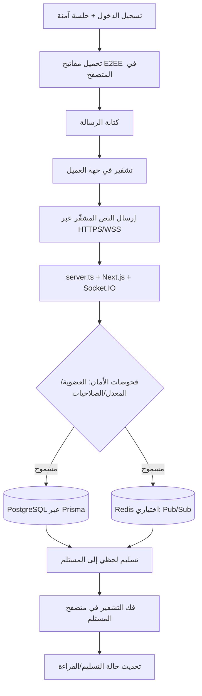

<p align="center">
  
</p>

<p align="center">
  <a href="./LICENSE"></a>
  
  
</p>

<p align="center">
  <a href="README.md">English</a> |
  <a href="README.fa.md">فارسی</a> |
  <a href="README.ru.md">Русский</a> |
  <a href="README.ar.md">العربية</a> |
  <a href="README.zh.md">中文</a> |
  <a href="README.es.md">Español</a> |
  <a href="README.th.md">ไทย</a> |
  <a href="README.pt.md">Português</a> |
  <a href="README.de.md">Deutsch</a> |
  <a href="README.da.md">Dansk</a> |
  <a href="README.sv.md">Svenska</a> |
  <a href="README.tr.md">Türkçe</a>
</p>

---

<div dir="rtl">

## نظرة عامة

**Elahe Messenger** هو تطبيق مراسلة مفتوح المصدر، مستضاف ذاتيًا، مع تشفير كامل من طرف إلى طرف (E2EE)، مصمم للفرق والمجتمعات التي تتطلب التحكم الكامل في بياناتها. مبني على **Next.js 15** و**React 19** و**Socket.IO** مع **Prisma ORM** و**PostgreSQL**.

> لا يرى الخادم أبدًا نص الرسائل. جميع عمليات التشفير تتم في المتصفح.

---

## المميزات

| الفئة | القدرات |
|---|---|
| 🔐 **التشفير** | E2EE في المتصفح (ECDH-P256، HKDF-SHA256، AES-256-GCM) |
| 💬 **المراسلة** | رسائل خاصة، مجموعات، قنوات، ردود فعل، تعديل، مسودات |
| 👥 **الاجتماعية** | إدارة جهات الاتصال، المجتمعات، روابط الدعوة |
| 🛡️ **الأمان** | TOTP/2FA، تحديد المعدل، captcha رياضي محلي، سجل التدقيق |
| 📦 **العمليات** | Docker Compose، مثبّت بسطر واحد، SSL تلقائي عبر Caddy |
| 📱 **PWA** | قابل للتثبيت على أي جهاز |

---

## المعمارية (خوارزمية + مخطط تدفق عمل المراسلة)

### خوارزمية تدفق الرسائل من طرف إلى طرف

1. **المصادقة وربط الجلسة**: يسجّل المستخدم الدخول وتبقى الجلسة المحمية عبر Cookie مع فحوصات CSRF/Origin.
2. **تحميل مفاتيح E2EE في العميل**: يتم إنشاء/تحميل المفاتيح داخل المتصفح (Web Crypto + IndexedDB).
3. **التشفير في جهة العميل**: تُشفَّر الرسالة قبل الإرسال، ولا يحتاج الخادم للنص الصريح.
4. **إرسال فوري**: يتم إرسال النص المشفّر عبر HTTPS/WSS إلى `server.ts` وSocket.IO.
5. **ضوابط الأمان في الخادم**: يتم فرض العضوية، الصلاحيات، تحديد المعدل، مكافحة الإساءة، وسجل التدقيق.
6. **التخزين والتوزيع**: تُحفَظ البيانات المشفّرة عبر Prisma في PostgreSQL، ويمكن استخدام Redis اختياريًا للتوسعة عبر Pub/Sub.
7. **تسليم للمستلمين**: تصل الرسالة المشفّرة لحظيًا إلى جلسات الأجهزة المصرح بها.
8. **فك التشفير في المتصفح فقط**: يفك متصفح المستلم التشفير محليًا مع تحديث حالة التسليم/القراءة.

### مخطط بصري للتدفق



---

## المتطلبات

| التبعية | الحد الأدنى للإصدار |
|---|---|
| Node.js | 20 LTS |
| npm | 10+ |
| PostgreSQL | 15+ |
| Redis | 6+ (اختياري) |
| Docker + Compose | v2+ |

---

## البداية السريعة

### المثبّت بسطر واحد (Linux/macOS)

```bash
curl -fsSL https://raw.githubusercontent.com/ehsanking/ElaheMessenger/main/install.sh | ( [ "$(id -u)" -eq 0 ] && bash || sudo bash )
```

### التثبيت اليدوي

```bash
git clone https://github.com/ehsanking/ElaheMessenger.git
cd ElaheMessenger
cp .env.example .env.local
# عدّل .env.local: DATABASE_URL, JWT_SECRET, ENCRYPTION_KEY, APP_URL
npm install
npx prisma migrate deploy
npm run build
npm start
```

---

## التكوين

| المتغير | الافتراضي | الوصف |
|---|---|---|
| `DATABASE_URL` | SQLite (dev فقط) | سلسلة اتصال PostgreSQL |
| `APP_URL` | `http://localhost:3000` | الرابط العام للتطبيق |
| `JWT_SECRET` | تلقائي | مفتاح توقيع الجلسة |
| `ENCRYPTION_KEY` | تلقائي | مفتاح تشفير AES |
| `ADMIN_PASSWORD` | تلقائي | **غيّره فور أول تسجيل دخول** |
| `REDIS_URL` | فارغ | تفعيل تجميع Socket.IO |

---

## النشر بـ Docker

```bash
# التطوير
docker compose up -d

# الإنتاج (مع SSL تلقائي)
docker compose -f compose.prod.yaml up -d --build
```

---

## الأمان

- **التشفير الكامل**: تُشفَّر الرسائل في المتصفح قبل الإرسال
- **خادم أعمى**: يخزن النص المشفر فقط
- **2FA/TOTP**: متوافق مع جميع تطبيقات المصادقة القياسية
- **تحديد المعدل**: حدود per-IP على طبقتي HTTP وWebSocket

للإبلاغ عن ثغرات: [SECURITY.md](./SECURITY.md)

---

## المساهمة

```bash
npm run dev        # خادم التطوير
npm run build      # بناء الإنتاج
npm run lint       # فحص ESLint
npm test           # الاختبارات
npm run db:setup   # إعداد قاعدة البيانات
```

استخدم [Conventional Commits](https://www.conventionalcommits.org/) وافتح PR إلى `main`.

---

## الترخيص

مُصدَر تحت [ترخيص MIT](./LICENSE). حقوق النشر © 2026 مساهمو Elahe Messenger.

<p align="center">صُنع بـ ❤️ بواسطة <a href="https://github.com/ehsanking">@ehsanking</a> · <a href="https://t.me/kingithub">t.me/kingithub</a></p>

</div>

---

## Production Security Update (2026-03)

For critical production safety guidance, see the English README sections:
- **Production Networking Policy** (public vs private ports)
- **Database Hardening** (`POSTGRES_*` bootstrap role vs `APP_DB_*` runtime role)
- **UFW manual, opt-in setup** (never auto-enable before allowing SSH)

Keep PostgreSQL (`5432`) internal-only by default.

---

## Donate

If this project helps you, you can support its maintenance:

- **USDT (TRC20 / Tether):** `TKPswLQqd2e73UTGJ5prxVXBVo7MTsWedU`
- **TRON (TRX):** `TKPswLQqd2e73UTGJ5prxVXBVo7MTsWedU`

