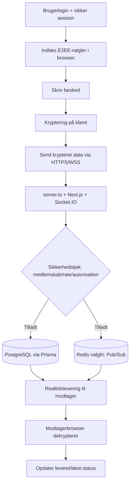

<p align="center">
  
</p>

<p align="center">
  <a href="./LICENSE"></a>
  
  
</p>

<p align="center">
  <a href="README.md">English</a> |
  <a href="README.fa.md">فارسی</a> |
  <a href="README.ru.md">Русский</a> |
  <a href="README.ar.md">العربية</a> |
  <a href="README.zh.md">中文</a> |
  <a href="README.es.md">Español</a> |
  <a href="README.th.md">ไทย</a> |
  <a href="README.pt.md">Português</a> |
  <a href="README.de.md">Deutsch</a> |
  <a href="README.da.md">Dansk</a> |
  <a href="README.sv.md">Svenska</a> |
  <a href="README.tr.md">Türkçe</a>
</p>

---

## Oversigt

**Elahe Messenger** er en open-source, selvhostet beskedplatform med ende-til-ende-kryptering (E2EE), designet til teams og fællesskaber der kræver fuld kontrol over deres data. Bygget med **Next.js 15**, **React 19**, **Socket.IO** og **Prisma ORM** med **PostgreSQL**.

> Serveren ser aldrig klarteksten i beskeder. Alle kryptografiske operationer udføres i browseren.

---

## Funktioner

| Kategori | Muligheder |
|---|---|
| 🔐 **Kryptering** | Browser-side E2EE (ECDH-P256, HKDF-SHA256, AES-256-GCM) |
| 💬 **Beskeder** | Direkte beskeder, grupper, kanaler, reaktioner, redigering, kladder |
| 👥 **Social** | Kontakthåndtering, fællesskaber, invitationslinks |
| 🛡️ **Sikkerhed** | TOTP/2FA, hastighedsbegrænsning, lokal matematik-captcha, revisionslog |
| 📦 **DevOps** | Docker Compose, én-linjes installationsprogram, automatisk SSL via Caddy |
| 📱 **PWA** | Kan installeres på alle enheder |

---

## Arkitektur (Algoritme + visuel flowchart)

### End-to-end algoritme for beskedflow

1. **Godkendelse og sessionsbinding**: brugeren logger ind, og den sikre cookiesession beskyttes af CSRF-/origin-kontrol.
2. **Indlæs klientnøgler**: E2EE-nøgler oprettes/indlæses i browseren (Web Crypto + IndexedDB).
3. **Kryptering på klienten**: beskeden krypteres før afsendelse; serveren skal ikke bruge klartekst.
4. **Realtidsafsendelse**: krypteret payload sendes via HTTPS/WSS til `server.ts` og Socket.IO.
5. **Sikkerhedskontrol på serveren**: medlemskab, autorisation, rate limiting, anti-misbrug og audit-log håndhæves.
6. **Persistens og distribution**: krypterede data lagres via Prisma i PostgreSQL; valgfri Redis bruges til Pub/Sub-skalering.
7. **Levering til modtagerenheder**: autoriserede modtagersessioner får krypteret data i realtid.
8. **Dekryptering kun hos modtager**: modtagerens browser dekrypterer lokalt og opdaterer leveret/læst-status.

### Visuelt flow



---

## Krav

| Afhængighed | Minimumsversion |
|---|---|
| Node.js | 20 LTS |
| npm | 10+ |
| PostgreSQL | 15+ |
| Redis | 6+ (valgfri) |
| Docker + Compose | v2+ |

---

## Hurtig start

```bash
curl -fsSL https://raw.githubusercontent.com/ehsanking/ElaheMessenger/main/install.sh | ( [ "$(id -u)" -eq 0 ] && bash || sudo bash )
```

### Manuel installation

```bash
git clone https://github.com/ehsanking/ElaheMessenger.git
cd ElaheMessenger
cp .env.example .env.local
npm install && npx prisma migrate deploy
npm run build && npm start
```

---

## Konfiguration

| Variabel | Standard | Beskrivelse |
|---|---|---|
| `DATABASE_URL` | SQLite (kun dev) | PostgreSQL-forbindelsesstreng |
| `APP_URL` | `http://localhost:3000` | Offentlig URL |
| `JWT_SECRET` | Automatisk | Session-token signeringsnøgle |
| `ADMIN_PASSWORD` | Automatisk | **Skift efter første login** |

---

## Licens

Udgivet under [MIT-licensen](./LICENSE). Copyright © 2026 Elahe Messenger Contributors.

<p align="center">Lavet med ❤️ af <a href="https://github.com/ehsanking">@ehsanking</a> · <a href="https://t.me/kingithub">t.me/kingithub</a></p>

---

## Donate

If this project helps you, you can support its maintenance:

- **USDT (TRC20 / Tether):** `TKPswLQqd2e73UTGJ5prxVXBVo7MTsWedU`
- **TRON (TRX):** `TKPswLQqd2e73UTGJ5prxVXBVo7MTsWedU`

