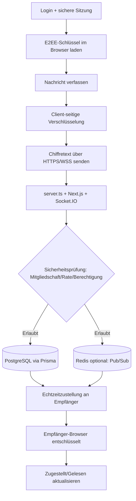

<p align="center">
  
</p>

<p align="center">
  <a href="./LICENSE"></a>
  
  
</p>

<p align="center">
  <a href="README.md">English</a> |
  <a href="README.fa.md">فارسی</a> |
  <a href="README.ru.md">Русский</a> |
  <a href="README.ar.md">العربية</a> |
  <a href="README.zh.md">中文</a> |
  <a href="README.es.md">Español</a> |
  <a href="README.th.md">ไทย</a> |
  <a href="README.pt.md">Português</a> |
  <a href="README.de.md">Deutsch</a> |
  <a href="README.da.md">Dansk</a> |
  <a href="README.sv.md">Svenska</a> |
  <a href="README.tr.md">Türkçe</a>
</p>

---

## Überblick

**Elahe Messenger** ist eine quelloffene, selbst gehostete Ende-zu-Ende-verschlüsselte Messaging-Plattform für Teams und Gemeinschaften, die vollständige Kontrolle über ihre Daten benötigen. Gebaut mit **Next.js 15**, **React 19**, **Socket.IO** und **Prisma ORM** mit **PostgreSQL**.

> Der Server sieht niemals den Klartext von Nachrichten. Alle kryptografischen Operationen werden im Browser durchgeführt.

---

## Funktionen

| Kategorie | Fähigkeiten |
|---|---|
| 🔐 **Verschlüsselung** | Browser-seitiges E2EE (ECDH-P256, HKDF-SHA256, AES-256-GCM) |
| 💬 **Messaging** | Direktnachrichten, Gruppen, Kanäle, Reaktionen, Bearbeitung, Entwürfe |
| 👥 **Soziales** | Kontaktverwaltung, Gemeinschaften, Einladungslinks |
| 🛡️ **Sicherheit** | TOTP/2FA, Rate Limiting, lokales Mathe-Captcha, Audit-Log |
| 📦 **DevOps** | Docker Compose, Einzeilen-Installer, Auto-SSL mit Caddy |
| 📱 **PWA** | Auf jedem Gerät installierbar |

---

## Architektur (Algorithmus + visuelles Ablaufdiagramm)

### End-to-End-Algorithmus für den Nachrichtenfluss

1. **Authentifizieren und Sitzung binden**: Nutzer meldet sich an; sichere Cookie-Sitzung bleibt durch CSRF-/Origin-Prüfung geschützt.
2. **Client-Schlüssel laden**: E2EE-Schlüssel werden im Browser erzeugt/geladen (Web Crypto + IndexedDB).
3. **Client-seitige Verschlüsselung**: Nachricht wird vor dem Versand verschlüsselt; der Server benötigt keinen Klartext.
4. **Echtzeitversand**: Chiffretext wird per HTTPS/WSS an `server.ts` und Socket.IO gesendet.
5. **Serverseitige Sicherheitsprüfungen**: Mitgliedschaft, Berechtigung, Rate-Limits, Anti-Missbrauch und Audit-Logging werden erzwungen.
6. **Speichern und Verteilen**: Verschlüsselte Daten werden via Prisma in PostgreSQL gespeichert; optionales Redis dient der Pub/Sub-Skalierung.
7. **Zustellung an Empfängergeräte**: autorisierte Empfängersitzungen erhalten Chiffretext in Echtzeit.
8. **Entschlüsselung nur im Empfänger-Browser**: Browser entschlüsselt lokal und aktualisiert Zustell-/Lesestatus.

### Visueller Ablauf



---

## Anforderungen

| Abhängigkeit | Mindestversion |
|---|---|
| Node.js | 20 LTS |
| npm | 10+ |
| PostgreSQL | 15+ |
| Redis | 6+ (optional) |
| Docker + Compose | v2+ |

---

## Schnellstart

### Einzeilen-Installer (Linux/macOS)

```bash
curl -fsSL https://raw.githubusercontent.com/ehsanking/ElaheMessenger/main/install.sh | ( [ "$(id -u)" -eq 0 ] && bash || sudo bash )
```

### Manuelle Installation

```bash
git clone https://github.com/ehsanking/ElaheMessenger.git
cd ElaheMessenger
cp .env.example .env.local
# .env.local bearbeiten: DATABASE_URL, JWT_SECRET, ENCRYPTION_KEY, APP_URL
npm install
npx prisma migrate deploy
npm run build
npm start
```

---

## Konfiguration

| Variable | Standard | Beschreibung |
|---|---|---|
| `DATABASE_URL` | SQLite (nur dev) | PostgreSQL-Verbindungsstring |
| `APP_URL` | `http://localhost:3000` | Öffentliche URL der Anwendung |
| `JWT_SECRET` | Automatisch | Session-Token-Signierschlüssel |
| `ENCRYPTION_KEY` | Automatisch | AES-Verschlüsselungsschlüssel |
| `ADMIN_PASSWORD` | Automatisch | **Nach erstem Login ändern** |
| `REDIS_URL` | Leer | Aktiviert Socket.IO-Clustering |

---

## Docker-Deployment

```bash
# Entwicklung
docker compose up -d

# Produktion (mit Auto-SSL)
docker compose -f compose.prod.yaml up -d --build
```

---

## Sicherheit

- **Ende-zu-Ende-Verschlüsselung**: Nachrichten werden vor dem Senden im Browser verschlüsselt
- **Blinder Server**: Speichert nur verschlüsselten Text
- **2FA/TOTP**: RFC 6238, kompatibel mit allen Standard-Authenticator-Apps
- **Rate Limiting**: Per-IP-Limits auf HTTP- und WebSocket-Ebene

Schwachstellen melden: [SECURITY.md](./SECURITY.md)

---

## Beitragen

```bash
npm run dev        # Dev-Server
npm run build      # Produktions-Build
npm run lint       # ESLint
npm test           # Tests
npm run db:setup   # DB-Setup
```

Nutze [Conventional Commits](https://www.conventionalcommits.org/) und öffne einen PR zu `main`.

---

## Lizenz

Veröffentlicht unter der [MIT-Lizenz](./LICENSE). Copyright © 2026 Elahe Messenger Contributors.

<p align="center">Mit ❤️ erstellt von <a href="https://github.com/ehsanking">@ehsanking</a> · <a href="https://t.me/kingithub">t.me/kingithub</a></p>

---

## Production Security Update (2026-03)

For critical production safety guidance, see the English README sections:
- **Production Networking Policy** (public vs private ports)
- **Database Hardening** (`POSTGRES_*` bootstrap role vs `APP_DB_*` runtime role)
- **UFW manual, opt-in setup** (never auto-enable before allowing SSH)

Keep PostgreSQL (`5432`) internal-only by default.

---

## Donate

If this project helps you, you can support its maintenance:

- **USDT (TRC20 / Tether):** `TKPswLQqd2e73UTGJ5prxVXBVo7MTsWedU`
- **TRON (TRX):** `TKPswLQqd2e73UTGJ5prxVXBVo7MTsWedU`

