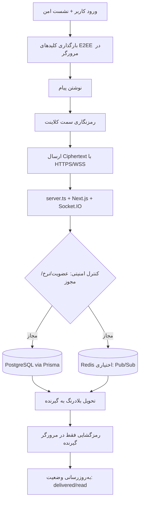

<p align="center">
  
</p>

<p align="center">
  <a href="./LICENSE"></a>
  
  
</p>

<p align="center">
  <a href="README.md">English</a> |
  <a href="README.fa.md">فارسی</a> |
  <a href="README.ru.md">Русский</a> |
  <a href="README.ar.md">العربية</a> |
  <a href="README.zh.md">中文</a> |
  <a href="README.es.md">Español</a> |
  <a href="README.th.md">ไทย</a> |
  <a href="README.pt.md">Português</a> |
  <a href="README.de.md">Deutsch</a> |
  <a href="README.da.md">Dansk</a> |
  <a href="README.sv.md">Svenska</a> |
  <a href="README.tr.md">Türkçe</a>
</p>

---

<div dir="rtl">

## معرفی

**پیام‌رسان الهه** یک پیام‌رسان متن‌باز، خود-میزبان و رمزنگاری شده از سر تا ته (E2EE) است که برای تیم‌ها، جوامع و افرادی ساخته شده که کنترل کامل بر داده‌های خود را می‌خواهند. این پلتفرم بر پایه **Next.js 15**، **React 19** و **Socket.IO** بر بستر **Node.js** ساخته شده و از **Prisma ORM** با **PostgreSQL** (یا SQLite برای توسعه محلی) بهره می‌برد.

> سرور هرگز متن پیام‌ها را نمی‌بیند. تمام عملیات رمزنگاری در مرورگر کاربر انجام می‌شود.

---

## فهرست مطالب

- [ویژگی‌ها](#ویژگیها)
- [معماری](#معماری)
- [پیش‌نیازها](#پیشنیازها)
- [شروع سریع](#شروع-سریع)
- [نصب دستی](#نصب-دستی)
- [پیکربندی](#پیکربندی)
- [استقرار با Docker](#استقرار-با-docker)
- [امنیت](#امنیت)
- [مشارکت](#مشارکت)
- [مجوز](#مجوز)

---

## ویژگی‌ها

| دسته‌بندی | قابلیت‌ها |
|---|---|
| 🔐 **رمزنگاری** | E2EE در مرورگر (ECDH-P256، HKDF-SHA256، AES-256-GCM)، forward secrecy |
| 💬 **پیام‌رسانی** | پیام خصوصی، گروه، کانال، واکنش، ویرایش، پیش‌نویس |
| 👥 **اجتماعی** | مدیریت مخاطبین، گروه‌های جامعه، لینک دعوت، نقش‌های عضو |
| 🛡️ **امنیت** | TOTP/احراز دو مرحله‌ای، نشست امن، محدودیت نرخ، کپچای ریاضی محلی، لاگ حسابرسی |
| 🧭 **مدیریت** | کنترل کاربران، تنظیمات، داشبورد مشاهده‌پذیری |
| 📦 **عملیات** | Docker Compose، نصب‌کننده یک‌خطی، SSL خودکار Caddy |
| 📱 **PWA** | قابل نصب روی همه دستگاه‌ها |

---

## معماری (الگوریتم + چارت عملکرد مسنجر الهه)

### الگوریتم جریان پیام (End-to-End)

1. **احراز هویت و اعتبارسنجی نشست**: کاربر وارد می‌شود، نشست با کوکی امن و کنترل‌های CSRF/Origin معتبر می‌ماند.
2. **تولید/بارگذاری کلیدها در کلاینت**: کلیدهای E2EE داخل مرورگر (Web Crypto + IndexedDB) مدیریت می‌شوند.
3. **رمزنگاری سمت کلاینت**: قبل از ارسال، پیام در مرورگر رمز می‌شود؛ سرور به متن خام دسترسی ندارد.
4. **ارسال بلادرنگ**: پیام رمز شده از طریق HTTPS/WSS به `server.ts` و Socket.IO ارسال می‌شود.
5. **کنترل‌های امنیتی سرور**: عضویت، مجوز، محدودیت نرخ، قوانین ضد‌سوءاستفاده و ثبت حسابرسی اعمال می‌شوند.
6. **ماندگاری و توزیع**: داده رمز‌شده با Prisma در PostgreSQL ذخیره می‌شود؛ Redis (اختیاری) برای مقیاس‌پذیری و Pub/Sub استفاده می‌شود.
7. **تحویل به گیرنده**: پیام رمز‌شده بلادرنگ به دستگاه‌های مجاز گیرنده Push می‌شود.
8. **رمزگشایی فقط در مرورگر گیرنده**: گیرنده با کلیدهای محلی پیام را باز می‌کند و وضعیت تحویل/خواندن به‌روزرسانی می‌شود.

### چارت تصویری عملکرد



---

## پیش‌نیازها

| وابستگی | نسخه حداقل |
|---|---|
| Node.js | 20 LTS |
| npm | 10+ |
| PostgreSQL | 15+ |
| Redis | 6+ (اختیاری) |
| Docker + Compose | v2+ |

---

## شروع سریع

### نصب‌کننده یک‌خطی (Linux/macOS)

```bash
curl -fsSL https://raw.githubusercontent.com/ehsanking/ElaheMessenger/main/install.sh | bash
```

نصب‌کننده به صورت خودکار:
۱. پیش‌نیازها را بررسی می‌کند
۲. مخزن را clone می‌کند
۳. برای دامنه/IP تنظیمات می‌پرسد
۴. secrets را تولید می‌کند
۵. سرویس‌ها را با Docker Compose و SSL خودکار راه‌اندازی می‌کند

---

## نصب دستی

```bash
# ۱. کلون کردن مخزن
git clone https://github.com/ehsanking/ElaheMessenger.git
cd ElaheMessenger

# ۲. کپی فایل محیطی
cp .env.example .env.local

# ۳. ویرایش .env.local — حداقل باید تنظیم شود:
#    DATABASE_URL, JWT_SECRET, ENCRYPTION_KEY, APP_URL

# ۴. نصب وابستگی‌ها (Prisma client به صورت خودکار تولید می‌شود)
npm install

# ۵. اعمال migration پایگاه داده
npx prisma migrate deploy

# ۶. ساخت برای production
npm run build

# ۷. راه‌اندازی
npm start
```

---

## پیکربندی

| متغیر | پیش‌فرض | توضیح |
|---|---|---|
| `DATABASE_URL` | SQLite (فقط dev) | رشته اتصال PostgreSQL برای production |
| `APP_URL` | `http://localhost:3000` | آدرس عمومی برنامه |
| `JWT_SECRET` | خودکار | کلید امضای توکن نشست |
| `ENCRYPTION_KEY` | خودکار | کلید رمزنگاری AES |
| `ADMIN_USERNAME` | `admin` | نام کاربری اولیه ادمین |
| `ADMIN_PASSWORD` | خودکار | رمز عبور اولیه — **بعد از اولین ورود تغییر دهید** |
| `REDIS_URL` | خالی | فعال‌سازی خوشه‌بندی Socket.IO |

---

## استقرار با Docker

```bash
# توسعه
docker compose up -d

# Production (با SSL خودکار)
docker compose -f compose.prod.yaml up -d --build
```

| سرویس | کانتینر | توضیح |
|---|---|---|
| App | `elahe-app` | سرور Next.js + Socket.IO |
| Database | `elahe-db` | PostgreSQL 16 |
| پروکسی | `elahe-caddy` | Caddy با SSL خودکار Let's Encrypt |

---

## امنیت

- **رمزنگاری سر تا ته**: پیام‌ها پیش از ارسال در مرورگر رمزنگاری می‌شوند
- **کوری سرور**: سرور فقط متن رمزشده ذخیره می‌کند
- **احراز دو مرحله‌ای**: TOTP/RFC 6238 سازگار با همه اپ‌های احراز هویت استاندارد
- **محدودیت نرخ**: محدودیت‌های per-IP در لایه HTTP و WebSocket
- **لاگ حسابرسی**: ثبت تمام اقدامات ادمین با IP و زمان‌بندی

برای گزارش آسیب‌پذیری، [SECURITY.md](./SECURITY.md) را ببینید.

---

## مشارکت

مشارکت‌ها歡迎 هستند. لطفاً:

1. Fork کنید و یک شاخه ویژگی بسازید: `git checkout -b feat/my-feature`
2. `npm run format` و `npm run lint` را اجرا کنید
3. با [Conventional Commits](https://www.conventionalcommits.org/) commit کنید
4. Pull Request باز کنید

### دستورات توسعه

```bash
npm run dev        # سرور dev با hot-reload
npm run build      # ساخت production
npm run lint       # بررسی ESLint
npm test           # اجرای تست‌ها
npm run db:setup   # تنظیم پایگاه داده
```

---

## مجوز

منتشرشده تحت [مجوز MIT](./LICENSE).

حق نشر © 2026 مشارکت‌کنندگان پیام‌رسان الهه.

---

<p align="center">
  ساخته‌شده با ❤️ توسط <a href="https://github.com/ehsanking">@ehsanking</a> و مشارکت‌کنندگان
  <br/>
  <a href="https://t.me/kingithub">t.me/kingithub</a>
</p>

</div>

---

## Production Security Update (2026-03)

For critical production safety guidance, see the English README sections:
- **Production Networking Policy** (public vs private ports)
- **Database Hardening** (`POSTGRES_*` bootstrap role vs `APP_DB_*` runtime role)
- **UFW manual, opt-in setup** (never auto-enable before allowing SSH)

Keep PostgreSQL (`5432`) internal-only by default.
