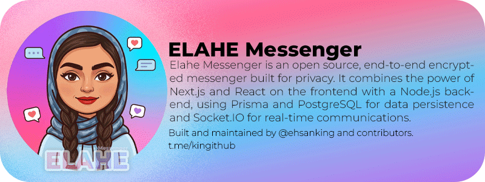

<p align="center">
  
</p>

<p align="center">
  <a href="./LICENSE"></a>
  
  
  
  
  
</p>

<p align="center">
  <a href="README.md">English</a> |
  <a href="README.fa.md">فارسی</a> |
  <a href="README.ru.md">Русский</a> |
  <a href="README.ar.md">العربية</a> |
  <a href="README.zh.md">中文</a> |
  <a href="README.es.md">Español</a> |
  <a href="README.th.md">ไทย</a> |
  <a href="README.pt.md">Português</a> |
  <a href="README.de.md">Deutsch</a> |
  <a href="README.da.md">Dansk</a> |
  <a href="README.sv.md">Svenska</a> |
  <a href="README.tr.md">Türkçe</a>
</p>

---

## Overview

**Elahe Messenger** is an open-source, self-hosted, end-to-end encrypted messaging platform built for teams, communities, and individuals who demand full control over their data. It combines the power of **Next.js 15**, **React 19**, and **Socket.IO** on a **Node.js** runtime, backed by **Prisma ORM** with **PostgreSQL** (or SQLite for local development) and optionally scaled horizontally via **Redis**.

> The server never sees plaintext messages. All cryptographic operations are performed client-side using the Web Crypto API.

---

## Table of Contents

- [Features](#features)
- [Architecture](#architecture)
- [Requirements](#requirements)
- [Quick Start](#quick-start)
- [Manual Installation](#manual-installation)
- [Configuration](#configuration)
- [Docker Deployment](#docker-deployment)
- [Security](#security)
- [Contributing](#contributing)
- [License](#license)

---

## Features

| Category | Capabilities |
|---|---|
| 🔐 **Encryption** | Browser-side E2EE (ECDH-P256, HKDF-SHA256, AES-256-GCM), forward-secrecy ratchet |
| 💬 **Messaging** | Real-time DMs, group chats, channels, message reactions, edits, drafts |
| 👥 **Social** | Contact management, community groups, invite links, member roles |
| 🛡️ **Security** | TOTP/2FA, session binding, rate limiting, local math captcha, audit logs |
| 🧭 **Admin** | User management, ban/verify controls, settings panel, observability dashboard |
| 📦 **DevOps** | Docker Compose variants, one-line installer, Caddy auto-SSL, health checks |
| 📱 **PWA** | Installable app shell with cached static assets (chat sync still requires network) |
| 🔔 **Push** | VAPID web-push notifications, optional Firebase FCM fallback |

---

## Architecture

```
┌─────────────────────────────────────────────────────────┐
│                     Browser (Client)                    │
│  Next.js 15 (App Router) · React 19 · Tailwind CSS 4   │
│  Web Crypto API · Socket.IO Client · IndexedDB (E2EE)   │
└──────────────────────┬──────────────────────────────────┘
                       │ HTTPS / WSS
┌──────────────────────▼──────────────────────────────────┐
│                  Node.js Server (server.ts)              │
│  Next.js Request Handler · Socket.IO · Background Queue  │
└──────┬──────────────────────────────────────┬───────────┘
       │                                      │
┌──────▼──────┐                    ┌──────────▼──────────┐
│  PostgreSQL  │                    │  Redis (optional)   │
│  via Prisma  │                    │  Pub/Sub · Queue    │
└─────────────┘                    └─────────────────────┘
```

**Key design principles:**
- **Zero-trust server**: private keys never leave the browser
- **Stateless auth**: signed session cookies, no server-side session store required
- **Horizontal scaling**: Redis adapter for Socket.IO cluster mode
- **Graceful degradation**: SQLite fallback for development; Redis is optional

---

## Requirements

| Dependency | Minimum Version | Notes |
|---|---|---|
| Node.js | 20 LTS | Required for native crypto APIs |
| npm | 10+ | Package management |
| PostgreSQL | 15+ | Production database |
| Redis | 6+ | Optional; enables clustering |
| Docker + Compose | v2+ | Recommended for production |

---

## Quick Start

### One-Line Installer (Linux)

```bash
curl -fsSL https://raw.githubusercontent.com/ehsanking/ElaheMessenger/main/install.sh | bash
```

The installer will:
1. Check system requirements
2. Clone the repository
3. Prompt for domain / IP configuration
4. Generate secrets automatically
5. Start services via Docker Compose with auto-SSL (Caddy)

---

## Manual Installation

```bash
# 1. Clone the repository
git clone https://github.com/ehsanking/ElaheMessenger.git
cd ElaheMessenger

# 2. Copy environment template
cp .env.example .env

# 3. Edit .env — at minimum set:
#    DATABASE_URL, JWT_SECRET, ENCRYPTION_KEY, APP_URL

# 4. Install dependencies (generates Prisma client automatically)
npm install

# 5. Apply database migrations
npx prisma migrate deploy
# or for development:
npx prisma db push

# 6. Build for production
npm run build

# 7. Start
npm start
```

> **First run:** `npm install` is side-effect free for database state (client generation only). Run DB setup explicitly with `npm run db:init:dev` (SQLite/dev) or `npm run db:migrate:prod` (PostgreSQL/prod).

---

## Configuration

All configuration is done through environment variables. Copy `.env.example` to `.env` and set the values below.

Environment loading policy:
- **Local development**: load `.env`, then `.env.local` (if present)
- **Docker/production**: load only injected env values / `.env` (ignore `.env.local`)

### Core

| Variable | Default | Description |
|---|---|---|
| `DATABASE_URL` | SQLite (dev only) | PostgreSQL connection string for production |
| `APP_URL` | `http://localhost:3000` | Public base URL of the application |
| `NODE_ENV` | `development` | Set to `production` for production builds |
| `PORT` | `3000` | HTTP server port |

### Security *(auto-generated on first run)*

| Variable | Description |
|---|---|
| `JWT_SECRET` | HMAC-SHA256 signing secret for session tokens (≥ 32 chars) |
| `ENCRYPTION_KEY` | AES encryption key for sensitive fields |
| `ADMIN_USERNAME` | Initial admin username (required; no default) |
| `ADMIN_PASSWORD` | Initial admin password — **change immediately after first login** |

### Push Notifications *(optional)*

| Variable | Description |
|---|---|
| `VAPID_PUBLIC_KEY` | Web Push VAPID public key |
| `VAPID_PRIVATE_KEY` | Web Push VAPID private key |
| `VAPID_EMAIL` | Contact email for VAPID |

### Redis *(optional)*

| Variable | Description |
|---|---|
| `REDIS_URL` | e.g. `redis://localhost:6379` — enables Socket.IO clustering |

### Rate Limiting

| Variable | Default | Description |
|---|---|---|
| `RATE_LIMIT_WINDOW_MS` | `900000` | Rate limit window in milliseconds (15 min) |
| `RATE_LIMIT_MAX_REQUESTS` | `100` | Max requests per window per IP |
| `SOCKET_RATE_LIMIT_WINDOW_MS` | `10000` | Socket rate limit window (10 s) |
| `SOCKET_RATE_LIMIT_MAX` | `30` | Max socket events per window |

---

## Docker Deployment

### Development

```bash
docker compose up -d
```

### Production (with auto-SSL via Caddy)

```bash
# Set your domain and strong secrets in .env (or Docker secrets), then:
docker compose -f compose.prod.yaml up -d --build
```

> Security note: `docker-compose.yml` no longer provides secret/password fallbacks. Define production credentials explicitly via `.env` or Docker secrets before startup.

Container names and services:

| Service | Container | Description |
|---|---|---|
| App | `elahe-app` | Next.js + Socket.IO server |
| Database | `elahe-db` | PostgreSQL 16 |
| Reverse proxy | `elahe-caddy` | Caddy with automatic Let's Encrypt SSL |

Health endpoints:
- Liveness: `GET /api/health/live`
- Readiness: `GET /api/health/ready` (legacy `GET /api/health` remains as readiness)

---

## Security

Elahe Messenger is designed with a **privacy-first, zero-trust** philosophy:

- **End-to-End Encryption**: Messages are encrypted in the browser before transmission using `ECDH-P256` key agreement, `HKDF-SHA256` key derivation, and `AES-256-GCM` authenticated encryption.
- **Server Blindness**: The server stores only ciphertext. It cannot read message content.
- **Session Security**: Session tokens are HMAC-signed, HttpOnly, SameSite=Strict cookies with optional IP and User-Agent binding.
- **2FA/TOTP**: RFC 6238 compliant one-time passwords via any standard authenticator app.
- **Rate Limiting**: Per-IP limits enforced at both the HTTP and WebSocket layers, backed by Redis when available.
- **Audit Logging**: Admin actions are recorded with IP, timestamp, and actor for forensic traceability.

For vulnerability disclosures, see [SECURITY.md](./SECURITY.md).

---

## Project Structure

```
elahe-messenger/
├── app/                    # Next.js App Router pages and API routes
│   ├── actions/            # Server Actions (auth, messages, admin)
│   ├── api/                # REST API route handlers
│   ├── auth/               # Login, register, 2FA pages
│   ├── chat/               # Chat UI and profile pages
│   └── admin/              # Admin panel pages
├── components/             # Shared React components
├── lib/                    # Core server-side modules
│   ├── session.ts          # Session management
│   ├── crypto.ts           # E2EE primitives
│   ├── prisma.ts           # Database client singleton
│   ├── rate-limit.ts       # Rate limiting logic
│   └── local-captcha.ts    # Stateless math captcha
├── prisma/                 # Prisma schema and migrations
├── public/                 # Static assets (logo, manifest, SW)
├── scripts/                # Utility scripts (db-setup, backup)
├── server.ts               # Custom Node.js server (Socket.IO)
├── docker-compose.yml      # Development Compose
├── compose.prod.yaml       # Production Compose
└── install.sh              # One-line production installer
```

---

## Contributing

Contributions are welcome. Please follow these steps:

1. Fork the repository and create a feature branch: `git checkout -b feat/my-feature`
2. Follow the existing code style — run `npm run format` and `npm run lint` before committing
3. Write or update tests where applicable: `npm test`
4. Commit using [Conventional Commits](https://www.conventionalcommits.org/): `feat:`, `fix:`, `docs:`, etc.
5. Open a Pull Request against `main` with a clear description of changes

### Development Commands

```bash
npm run dev          # Start dev server with hot-reload
npm run build        # Production build
npm run lint         # ESLint check
npm run format       # Prettier auto-format
npm test             # Run Vitest test suite
npm run db:init:dev   # SQLite/dev bootstrap
npm run db:migrate:prod # PostgreSQL/prod migrations (fail-fast)
npm run backup       # Create database backup archive
```

---

## License

Released under the [MIT License](./LICENSE).

Copyright © 2025 Elahe Messenger Contributors.

---

<p align="center">
  Built with ❤️ by <a href="https://github.com/ehsanking">@ehsanking</a> and contributors.
  <br/>
  <a href="https://t.me/kingithub">t.me/kingithub</a>
</p>
