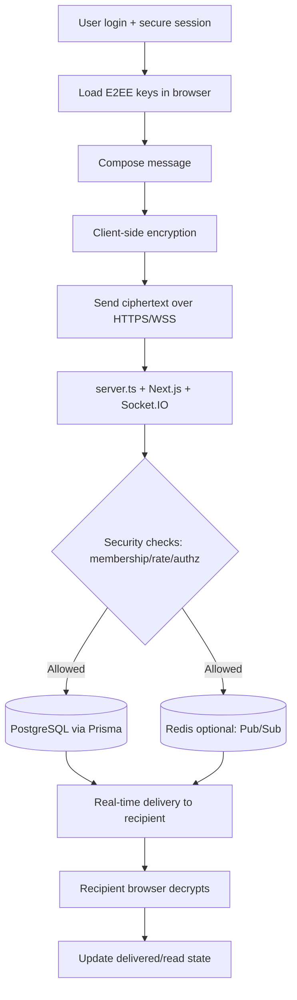

<p align="center">
  
</p>

<p align="center">
  <a href="./LICENSE"></a>
  
  
  
  
  
</p>

<p align="center">
  <a href="README.md">English</a> |
  <a href="README.fa.md">فارسی</a> |
  <a href="README.ru.md">Русский</a> |
  <a href="README.ar.md">العربية</a> |
  <a href="README.zh.md">中文</a> |
  <a href="README.es.md">Español</a> |
  <a href="README.th.md">ไทย</a> |
  <a href="README.pt.md">Português</a> |
  <a href="README.de.md">Deutsch</a> |
  <a href="README.da.md">Dansk</a> |
  <a href="README.sv.md">Svenska</a> |
  <a href="README.tr.md">Türkçe</a>
</p>

---

## Overview

**Elahe Messenger** is an open-source, self-hosted, end-to-end encrypted messaging platform built for teams, communities, and individuals who demand full control over their data. It combines the power of **Next.js 15**, **React 19**, and **Socket.IO** on a **Node.js** runtime, backed by **Prisma ORM** with **PostgreSQL** (or SQLite for local development) and optionally scaled horizontally via **Redis**.

> Client apps encrypt direct-message content before transmission. The server primarily handles ciphertext payloads, while still processing operational metadata (membership, timestamps, audit/security events).

---

## Table of Contents

- [Features](#features)
- [Architecture](#architecture)
- [Requirements](#requirements)
- [Quick Start](#quick-start)
- [Manual Installation](#manual-installation)
- [Configuration](#configuration)
- [Docker Deployment](#docker-deployment)
- [Security](#security)
- [Capability Maturity](#capability-maturity)
- [Crypto Status](#crypto-status)
- [Runtime Topology](#runtime-topology)
- [Threat Model](#threat-model)
- [Contributing](#contributing)
- [License](#license)

---

## Features

| Category | Capabilities |
|---|---|
| 🔐 **Encryption** | Browser-side E2EE for direct messages (ECDH-P256, HKDF-SHA256, AES-256-GCM); advanced ratcheting remains transitional |
| 💬 **Messaging** | Real-time DMs, group chats, channels, message reactions, edits, drafts |
| 👥 **Social** | Contact management, community groups, invite links, member roles |
| 🛡️ **Security** | TOTP/2FA, session binding, rate limiting, local math captcha, audit logs |
| 🧭 **Admin** | User management, ban/verify controls, settings panel, observability dashboard |
| 📦 **DevOps** | Docker Compose variants, one-line installer, Caddy auto-SSL, health checks |
| 📱 **PWA** | Installable app shell with cached static assets (chat sync still requires network) |
| 🔔 **Push** | VAPID web-push notifications, optional Firebase FCM fallback |

---

## Architecture

### End-to-End message flow algorithm

1. **Authenticate and bind session**: user signs in; secure cookie session remains guarded by CSRF/origin checks.
2. **Load client key material**: E2EE keys are generated/loaded in-browser (Web Crypto + IndexedDB).
3. **Encrypt on client**: message content is encrypted before transmission; server should not require plaintext.
4. **Send in real-time**: ciphertext is sent over HTTPS/WSS to `server.ts` and Socket.IO.
5. **Apply server-side guards**: membership, authorization, rate limits, anti-abuse rules, and audit logging are enforced.
6. **Persist and distribute**: encrypted payload is stored via Prisma in PostgreSQL; optional Redis supports pub/sub scaling.
7. **Deliver to recipient devices**: authorized recipient sessions receive ciphertext in real-time.
8. **Decrypt only on recipient client**: browser decrypts locally and updates delivery/read state.

### Visual runtime chart



---

## Requirements

| Dependency | Minimum Version | Notes |
|---|---|---|
| Node.js | 20 LTS | Required for native crypto APIs |
| npm | 10+ | Package management |
| PostgreSQL | 15+ | Production database |
| Redis | 6+ | Optional; enables clustering |
| Docker + Compose | v2+ | Recommended for production |

---

## Quick Start

### Installer (Linux, production-safe flow)

```bash
# 1) One-line install (works for root and non-root users)
curl -fsSL https://raw.githubusercontent.com/ehsanking/ElaheMessenger/main/install.sh | ( [ "$(id -u)" -eq 0 ] && bash || sudo bash )

# 2) Optional: Download from a pinned tag for reproducible installs
TAG="<release-tag>"
curl -fsSLo install.sh "https://raw.githubusercontent.com/ehsanking/ElaheMessenger/${TAG}/install.sh"

# 3) Verify checksum (recommended)
# Replace with the checksum published for the chosen release/tag.
echo "<sha256>  install.sh" | sha256sum -c -

# 4) Inspect installer before running
less install.sh

# 5) Run (installer auto-elevates with sudo when possible)
sudo bash install.sh
```

Reproducible alternatives:

```bash
# Pinned tag
sudo INSTALL_REF=<release-tag> bash install.sh

# Pinned commit
sudo INSTALL_REF=<40-char-commit-sha> bash install.sh
```
Unsafe/dev-only (mutable branch head):
```bash
curl -fsSLo install.sh https://raw.githubusercontent.com/ehsanking/ElaheMessenger/main/install.sh
sudo INSTALL_REF=main bash install.sh
```
1. **Fresh install** (new deployment)
2. **Upgrade** (safe in-place update, preserves `.env` secrets/data)
3. **Reinstall** (backs up existing directory first, then re-installs)

Installer safety behavior:
- Prompts for a **source ref strategy** (latest tag recommended, or explicit tag/commit); mutable `main` head is still available but warned.
- Preserves operator-managed config by default on upgrade (`.env`, `Caddyfile`, compose overrides). Regeneration happens only when explicitly selected.
- Preserves existing `.npmrc` and registry/mirror settings; creates a default `.npmrc` only when missing.
- Upgrade now prompts for proxy behavior: **preserve existing proxy config** (default) or **regenerate proxy config** (for ingress/domain/IP changes).
- Preserves existing production secrets on upgrade (`POSTGRES_*`, `APP_DB_*`, `DATABASE_URL`, auth/encryption/download secrets, admin credentials) unless you explicitly change values.
- Enforces database role separation: bootstrap role (`POSTGRES_*`) for DB provisioning and least-privilege runtime role (`APP_DB_*`) for the app `DATABASE_URL`.
- Creates timestamped upgrade backups (`.env`, `Caddyfile`, compose files) before update steps.
- Aborts upgrades when git sync fails or the worktree is dirty (no implicit `rm -rf` fallback).
- Uses Caddy on `:80/:443`; in IP-only mode the generated `APP_URL` uses `http://<server-ip>` (no internal `:3000` mismatch).
- Never prints bootstrap admin password in terminal output; auto-generated credentials are written once to a local secrets file with restrictive permissions.
- Verifies post-launch health in explicit phases: container health, local reverse-proxy routing, and external DNS/TLS readiness guidance.
- Fails install when local reverse-proxy routing does not work, and only warns for external DNS/TLS propagation uncertainty.
- Source trust defaults to a pinned tag when available; mutable branch-head installs are opt-in and explicitly warned during installer prompts.
- Fresh/reinstall writes bootstrap admin password to a one-time file (`./runtime/admin-bootstrap-password`) and passes it via `ADMIN_BOOTSTRAP_PASSWORD_FILE`.
- `ADMIN_USERNAME`/`ADMIN_PASSWORD` are create-only by default; if `ADMIN_BOOTSTRAP_RESET_EXISTING=true` is used, reset is consumed once per credential set (not repeated on every restart).
- Does **not** auto-enable UFW; firewall changes remain operator-driven.

---

## Manual Installation

```bash
# 1. Clone the repository
git clone https://github.com/ehsanking/ElaheMessenger.git
cd ElaheMessenger

# 2. Choose environment template
cp .env.example .env

# For production, use:
# cp production.env.example .env

# 3. Edit .env and set all required production values.
# Required for production:
#   APP_ENV=production
#   DATABASE_URL (PostgreSQL)
#   APP_DB_USER / APP_DB_PASSWORD
#   APP_URL / ALLOWED_ORIGINS
#   JWT_SECRET / SESSION_SECRET / ENCRYPTION_KEY / DOWNLOAD_TOKEN_SECRET
#   ADMIN_USERNAME and (ADMIN_PASSWORD or ADMIN_BOOTSTRAP_PASSWORD_FILE)
#   LOCAL_CAPTCHA_SECRET when CAPTCHA_PROVIDER=local

# 4. Install dependencies (generates Prisma client automatically)
npm install

# 5. Validate environment before first start
npm run validate:env -- --mode=production

# 6. Apply database migrations
npm run db:migrate:prod

# 7. Build for production
npm run build

# 8. Start
npm start
```

> **First run:** `npm install` is side-effect free for database state (client generation only). Run DB setup explicitly with `npm run db:init:dev` (SQLite/dev) or `npm run db:migrate:prod` (PostgreSQL/prod).

### Install/First-Run Diagnostics

- Docker startup now logs explicit bootstrap stages (env validation, DB wait, migration deploy, server handoff) in `docker-entrypoint.sh`.
- Migration failures are fail-fast and include actionable guidance (`DATABASE_URL` reachability, migration history, schema compatibility).
- Runtime/API failures return structured safe error payloads with:
  - `error` (safe message),
  - `errorCode` (machine-readable classification),
  - `requestId` (for correlation in server logs),
  - optional `action` (next step for operators/clients).
- For authentication/bootstrap failures, use the emitted `requestId` to correlate with JSON logs from `lib/logger.ts`.

---

## Configuration

All configuration is done through environment variables. Copy `.env.example` to `.env` and set the values below.

Environment loading policy:
- **Local development**: load `.env`, then `.env.local` (if present)
- **Docker/production**: load only injected env values / `.env` (ignore `.env.local`)

### Core

| Variable | Default | Description |
|---|---|---|
| `DATABASE_URL` | SQLite in `.env.example` | PostgreSQL connection string for production |
| `POSTGRES_USER` | *(none)* | Bootstrap/admin PostgreSQL role (provisioning only) |
| `POSTGRES_PASSWORD` | *(none)* | Bootstrap/admin PostgreSQL password |
| `POSTGRES_DB` | `elahe` | PostgreSQL database name |
| `APP_DB_USER` | *(none)* | Least-privilege runtime DB user for the app |
| `APP_DB_PASSWORD` | *(none)* | Least-privilege runtime DB password |
| `MIGRATION_DATABASE_URL` | *(none)* | PostgreSQL URL for migration/provisioning role (recommended: bootstrap role) |
| `APP_URL` | `http://localhost:3000` | Public base URL of the application |
| `NODE_ENV` | `development` | Set to `production` for production builds |
| `PORT` | `3000` | HTTP server port |

### Security *(auto-generated on first run)*

| Variable | Description |
|---|---|
| `JWT_SECRET` | HMAC-SHA256 signing secret for session tokens (≥ 32 chars) |
| `SESSION_SECRET` | Dedicated session-cookie signing secret (≥ 32 chars, no cross-domain reuse) |
| `ENCRYPTION_KEY` | AES encryption key for sensitive fields |
| `DOWNLOAD_TOKEN_SECRET` | Attachment/token signing secret (independent from session secret) |
| `LOCAL_CAPTCHA_SECRET` | HMAC key for local captcha challenge signing in production |
| `CAPTCHA_PROVIDER` | `recaptcha` (default) or `local` |
| `ADMIN_USERNAME` | Initial admin username (required; no default) |
| `ADMIN_PASSWORD` | Optional inline bootstrap password (legacy-compatible) |
| `ADMIN_BOOTSTRAP_PASSWORD_FILE` | Optional bootstrap password file path (preferred in production) |
| `ADMIN_BOOTSTRAP_STRICT` | Fail startup when bootstrap cannot complete (`true` on fresh installs) |

### Push Notifications *(optional)*

| Variable | Description |
|---|---|
| `VAPID_PUBLIC_KEY` | Web Push VAPID public key |
| `VAPID_PRIVATE_KEY` | Web Push VAPID private key |
| `VAPID_EMAIL` | Contact email for VAPID |

### Redis *(optional)*

| Variable | Description |
|---|---|
| `REDIS_URL` | e.g. `redis://localhost:6379` — enables Socket.IO clustering |

### Rate Limiting

| Variable | Default | Description |
|---|---|---|
| `RATE_LIMIT_WINDOW_MS` | `900000` | Rate limit window in milliseconds (15 min) |
| `RATE_LIMIT_MAX_REQUESTS` | `100` | Max requests per window per IP |
| `SOCKET_RATE_LIMIT_WINDOW_MS` | `10000` | Socket rate limit window (10 s) |
| `SOCKET_RATE_LIMIT_MAX` | `30` | Max socket events per window |

---

## Docker Deployment

### Development

```bash
docker compose up -d
```

### Production (with auto-SSL via Caddy)

```bash
# 1) Copy production env template and set strong values
cp production.env.example .env.production

# 2) Start using base + production override compose files
docker compose -f docker-compose.yml -f compose.prod.yaml --env-file .env.production up -d --build
```

`compose.prod.yaml` is an override file for `docker-compose.yml` (not a standalone compose file).

> Security note: define production credentials explicitly via `.env.production` (or Docker secrets) before startup.

Container names and services:

| Service | Container | Description |
|---|---|---|
| App | `elahe-app` | Next.js + Socket.IO server |
| Database | `elahe-db` | PostgreSQL 16 |
| Reverse proxy | `elahe-caddy` | Caddy with automatic Let's Encrypt SSL |

### Production Networking Policy (default compose)

| Port | Exposure | Why |
|---|---|---|
| `80/tcp` | **Public** | HTTP challenge + redirect / non-TLS IP mode |
| `443/tcp` | **Public** | HTTPS ingress |
| `443/udp` | Optional Public | HTTP/3 (QUIC) |
| `5432/tcp` | **Private only** | PostgreSQL (Docker-internal by default) |
| `3000/tcp` | **Private only** | App container behind Caddy |
| `6379/tcp` | **Private only** | Redis (if used) |

> The provided compose files keep PostgreSQL internal-only by default (no `ports:` publish for `db`). Do **not** expose `5432` unless you intentionally need remote database access.

### Database Hardening (bootstrap vs runtime role)

- `POSTGRES_USER` / `POSTGRES_PASSWORD`: bootstrap/admin database role used for first-time PostgreSQL provisioning.
- `APP_DB_USER` / `APP_DB_PASSWORD`: runtime least-privilege role used by Prisma/app in `DATABASE_URL`.
- `MIGRATION_DATABASE_URL`: role used for schema migrations (`prisma migrate deploy`); should remain bootstrap/provisioning-scoped.
- `DATABASE_URL` should point to `APP_DB_USER`, not the bootstrap account.
- Runtime role grants are intentionally limited to application DML/sequence/function access; schema-changing privileges stay in the migration/bootstrap role.
- Treat both bootstrap and runtime DB secrets as sensitive; rotate and store with least access (prefer secret manager or Docker secrets over plaintext files where possible).
- `SESSION_SECRET` is a dedicated session-signing secret and must not be reused as a fallback for unrelated security domains.

### Backup & Host-Compromise Notes

- Database dumps and volume backups can contain sensitive metadata and ciphertext payloads; protect backups with encryption-at-rest and strict access controls.
- If host disk/volume data (`pgdata`) is unencrypted and host is compromised, DB contents can be copied even without network DB exposure.
- Keep backup artifacts out of git and out of web-served paths.

### UFW (manual, opt-in, operator-aware)

> The installer intentionally does **not** enable UFW automatically.

Recommended sequence on Ubuntu/Debian hosts:

```bash
# 1) Allow SSH FIRST (use your actual SSH port if not 22)
sudo ufw allow 22/tcp

# 2) Allow web ingress
sudo ufw allow 80/tcp
sudo ufw allow 443/tcp

# 3) Optional HTTP/3/QUIC
sudo ufw allow 443/udp

# 4) Enable firewall
sudo ufw enable

# 5) Verify
sudo ufw status verbose
sudo ufw status numbered
```

Do **not** open these publicly unless intentionally required:
- `5432/tcp` (PostgreSQL)
- `3000/tcp` (app internal port)
- `6379/tcp` (Redis)

Operational safety:
- Docker and host firewalls can interact in non-obvious ways (NAT/forward chains). Validate effective exposure with external scans after changes.
- If locked out, regain console/KVM access and rollback rules with `sudo ufw disable` (or delete problematic numbered rules).
- Inspect logs via `sudo journalctl -u ufw --since "1 hour ago"` and `sudo dmesg | rg -i ufw`.

Health endpoints:
- Liveness: `GET /api/health/live`
- Readiness: `GET /api/health/ready` (legacy `GET /api/health` remains as readiness)

---


### PWA / Installed App Shell Behavior

- Web visitors opening `/` get the public marketing shell.
- Auth flows are isolated under `/auth/*`.
- The installed PWA starts at `/chat?source=pwa` (manifest `start_url`) so users land directly in the app shell.
- `/chat` is server-guarded: authenticated users see chat; unauthenticated users are redirected to `/auth/login?next=/chat`.
- Login and 2FA completion honor the `next` parameter and return users directly to chat.
- Registration redirects smoothly into login with `next=/chat` to avoid landing-page bounce loops.
- Installed PWA sessions that are not authenticated are routed server-side to `/auth/login?next=/chat` (not the public landing page).

## Security

Elahe Messenger is designed with a privacy-first model and explicit trust boundaries:

- **Implemented now**: Direct-message E2EE uses browser-side `ECDH-P256` + `HKDF-SHA256` + `AES-256-GCM`.
- **Not yet shipped**: Do not assume full X3DH/Double Ratchet parity for all paths; group/channel E2EE and advanced ratcheting remain transitional.
- **Server visibility**: Operators can access service metadata (accounts, membership, delivery/audit timestamps, network/session security signals) even when message bodies are ciphertext.
- **Session Security**: Session tokens are HMAC-signed, HttpOnly, SameSite=Strict cookies with optional IP and User-Agent binding; cookie `Secure` is derived from `APP_URL` scheme (or explicit `COOKIE_SECURE` override).
- **2FA/TOTP**: Password step now creates a short-lived pending-login challenge; TOTP verification requires that one-time challenge.
- **Rate Limiting**: Per-IP limits enforced at both the HTTP and WebSocket layers, backed by Redis when available.
- **Draft Privacy**: Server-side draft persistence stores encrypted draft fields only; plaintext `clientDraft` content is not persisted.
- **File Upload Policy**: Secure uploads enforce server allowlist checks by extension + MIME (case-insensitive) and reject MIME mismatches.
- **Audit Logging**: Admin actions are recorded with IP, timestamp, and actor for forensic traceability.

See detailed docs:
- [`docs/crypto-status.md`](./docs/crypto-status.md)
- [`docs/threat-model.md`](./docs/threat-model.md)
- [`docs/runtime-topology.md`](./docs/runtime-topology.md)

For vulnerability disclosures, see [SECURITY.md](./SECURITY.md).

---

## Capability Maturity

| Capability | Status | Notes |
|---|---|---|
| Direct messaging | **Stable** | Core 1:1 messaging path is operational and covered by existing authz checks. |
| Group messaging | **Beta** | Functional, but not E2EE-complete yet. |
| Encrypted attachments | **Beta** | Secure attachment route exists; keep using protected upload/download flows only. |
| Admin tooling | **Stable** | Includes moderation and audit workflows. |
| Push notifications | **Beta** | Production-capable with environment/provider dependencies. |
| Multi-device support | **Experimental** | Device bundle/session model is present but still evolving. |
| Ratcheting / advanced E2EE | **Experimental** | Transitional runtime support exists; do not market as fully completed protocol guarantees. |
| Crypto verification UX | **Planned** | Operator/user-facing verification flows need stronger UX and guidance. |
| Offline reliability | **Beta** | PWA shell and draft/offline queue support exist with network-dependent sync behavior. |

## Crypto Status

See [`docs/crypto-status.md`](./docs/crypto-status.md) for implementation-accurate cryptographic guarantees and known gaps.

## Runtime Topology

See [`docs/runtime-topology.md`](./docs/runtime-topology.md) for runtime separation, startup flow, and future split points.

## Threat Model

See [`docs/threat-model.md`](./docs/threat-model.md) for trust assumptions, metadata visibility, and hardening opportunities.

---

## Project Structure

```
elahe-messenger/
├── app/                    # Next.js App Router pages and API routes
│   ├── actions/            # Server Actions (auth, messages, admin)
│   ├── api/                # REST API route handlers
│   ├── auth/               # Login, register, 2FA pages
│   ├── chat/               # Chat UI and profile pages
│   └── admin/              # Admin panel pages
├── components/             # Shared React components
├── lib/                    # Core server-side modules
│   ├── session.ts          # Session management
│   ├── crypto.ts           # E2EE primitives
│   ├── prisma.ts           # Database client singleton
│   ├── rate-limit.ts       # Rate limiting logic
│   └── local-captcha.ts    # Stateless math captcha
├── prisma/                 # Prisma schema and migrations
├── public/                 # Static assets (logo, manifest, SW)
├── scripts/                # Utility scripts (db-setup, backup)
├── server.ts               # Custom Node.js server (Socket.IO)
├── docker-compose.yml      # Development Compose
├── compose.prod.yaml       # Production override for docker-compose.yml
└── install.sh              # One-line production installer
```

---

## Contributing

Contributions are welcome. Please follow these steps:

1. Fork the repository and create a feature branch: `git checkout -b feat/my-feature`
2. Follow the existing code style — run `npm run format` and `npm run lint` before committing
3. Write or update tests where applicable: `npm test`
4. Commit using [Conventional Commits](https://www.conventionalcommits.org/): `feat:`, `fix:`, `docs:`, etc.
5. Open a Pull Request against `main` with a clear description of changes

### Development Commands

```bash
npm run dev          # Start dev server with hot-reload
npm run build        # Production build
npm run lint         # ESLint check
npm run format       # Prettier auto-format
npm test             # Run Vitest test suite
npm run db:init:dev   # SQLite/dev bootstrap
npm run db:migrate:prod # PostgreSQL/prod migrations (fail-fast)
npm run backup       # Create database backup archive
```

---

## License

Released under the [MIT License](./LICENSE).

Copyright © 2026 Elahe Messenger Contributors.

---

<p align="center">
  Built with ❤️ by <a href="https://github.com/ehsanking">@ehsanking</a> and contributors.
  <br/>
  <a href="https://t.me/kingithub">t.me/kingithub</a>
</p>

---

## Donate

If this project helps you, you can support its maintenance:

- **USDT (TRC20 / Tether):** `TKPswLQqd2e73UTGJ5prxVXBVo7MTsWedU`
- **TRON (TRX):** `TKPswLQqd2e73UTGJ5prxVXBVo7MTsWedU`

