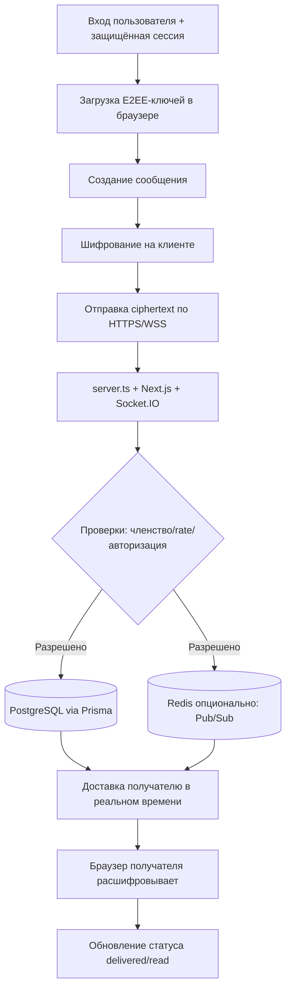

<p align="center">
  
</p>

<p align="center">
  <a href="./LICENSE"></a>
  
  
</p>

<p align="center">
  <a href="README.md">English</a> |
  <a href="README.fa.md">فارسی</a> |
  <a href="README.ru.md">Русский</a> |
  <a href="README.ar.md">العربية</a> |
  <a href="README.zh.md">中文</a> |
  <a href="README.es.md">Español</a> |
  <a href="README.th.md">ไทย</a> |
  <a href="README.pt.md">Português</a> |
  <a href="README.de.md">Deutsch</a> |
  <a href="README.da.md">Dansk</a> |
  <a href="README.sv.md">Svenska</a> |
  <a href="README.tr.md">Türkçe</a>
</p>

---

## Обзор

**Elahe Messenger** — мессенджер с открытым исходным кодом, собственным хостингом и сквозным шифрованием, созданный для команд и сообществ, которым важна полная приватность. Построен на **Next.js 15**, **React 19**, **Socket.IO** и **Prisma ORM** с **PostgreSQL**.

> Сервер никогда не видит открытый текст сообщений. Все криптографические операции выполняются в браузере.

---

## Возможности

| Категория | Возможности |
|---|---|
| 🔐 **Шифрование** | Сквозное E2EE в браузере (ECDH-P256, HKDF-SHA256, AES-256-GCM) |
| 💬 **Сообщения** | Личные сообщения, группы, каналы, реакции, редактирование, черновики |
| 👥 **Социальные** | Управление контактами, сообщества, пригласительные ссылки |
| 🛡️ **Безопасность** | TOTP/2FA, ограничение частоты запросов, математическая капча, журнал аудита |
| 📦 **DevOps** | Docker Compose, однострочный установщик, автоматический SSL через Caddy |
| 📱 **PWA** | Устанавливается на любое устройство |

---

## Архитектура (алгоритм + визуальная схема потока)

### Алгоритм сквозного потока сообщений

1. **Аутентификация и привязка сессии**: пользователь входит, защищённая cookie-сессия проходит проверки CSRF/origin.
2. **Загрузка ключей клиента**: ключи E2EE создаются/загружаются в браузере (Web Crypto + IndexedDB).
3. **Шифрование на клиенте**: сообщение шифруется до отправки; серверу не нужен открытый текст.
4. **Отправка в реальном времени**: ciphertext отправляется по HTTPS/WSS в `server.ts` и Socket.IO.
5. **Серверные проверки безопасности**: проверяются членство, авторизация, rate limiting, антиабьюз и аудит.
6. **Хранение и распределение**: зашифрованный payload сохраняется через Prisma в PostgreSQL; опциональный Redis масштабирует Pub/Sub.
7. **Доставка получателю**: авторизованные сессии получателя получают ciphertext в реальном времени.
8. **Расшифровка только в браузере получателя**: расшифровка локально, затем обновление статуса delivered/read.

### Визуальная схема



---

## Требования

| Зависимость | Минимальная версия |
|---|---|
| Node.js | 20 LTS |
| npm | 10+ |
| PostgreSQL | 15+ |
| Redis | 6+ (опционально) |
| Docker + Compose | v2+ |

---

## Быстрый старт

### Однострочный установщик (Linux/macOS)

```bash
curl -fsSL https://raw.githubusercontent.com/ehsanking/ElaheMessenger/main/install.sh | bash
```

### Ручная установка

```bash
git clone https://github.com/ehsanking/ElaheMessenger.git
cd ElaheMessenger
cp .env.example .env.local
# Отредактируйте .env.local: DATABASE_URL, JWT_SECRET, ENCRYPTION_KEY, APP_URL
npm install
npx prisma migrate deploy
npm run build
npm start
```

---

## Конфигурация

| Переменная | По умолчанию | Описание |
|---|---|---|
| `DATABASE_URL` | SQLite (только dev) | Строка подключения PostgreSQL |
| `APP_URL` | `http://localhost:3000` | Публичный URL приложения |
| `JWT_SECRET` | Авто | Ключ подписи сессионных токенов |
| `ENCRYPTION_KEY` | Авто | Ключ шифрования AES |
| `ADMIN_PASSWORD` | Авто | **Смените после первого входа** |
| `REDIS_URL` | Пусто | Включает кластеризацию Socket.IO |

---

## Развёртывание Docker

```bash
# Разработка
docker compose up -d

# Production (с авто-SSL)
docker compose -f compose.prod.yaml up -d --build
```

---

## Безопасность

- **Сквозное шифрование**: Сообщения шифруются в браузере перед отправкой
- **Слепой сервер**: Хранит только зашифрованные данные
- **2FA/TOTP**: RFC 6238, совместим с любым стандартным приложением аутентификации
- **Ограничение частоты**: Per-IP лимиты на HTTP и WebSocket уровнях

Сообщения об уязвимостях: [SECURITY.md](./SECURITY.md)

---

## Участие в разработке

```bash
npm run dev        # Dev-сервер
npm run build      # Production-сборка
npm run lint       # ESLint
npm test           # Тесты
npm run db:setup   # Настройка БД
```

Используйте [Conventional Commits](https://www.conventionalcommits.org/) и открывайте PR в `main`.

---

## Лицензия

Распространяется под [лицензией MIT](./LICENSE). Copyright © 2025 Elahe Messenger Contributors.

<p align="center">Создано с ❤️ <a href="https://github.com/ehsanking">@ehsanking</a> · <a href="https://t.me/kingithub">t.me/kingithub</a></p>

---

## Production Security Update (2026-03)

For critical production safety guidance, see the English README sections:
- **Production Networking Policy** (public vs private ports)
- **Database Hardening** (`POSTGRES_*` bootstrap role vs `APP_DB_*` runtime role)
- **UFW manual, opt-in setup** (never auto-enable before allowing SSH)

Keep PostgreSQL (`5432`) internal-only by default.
