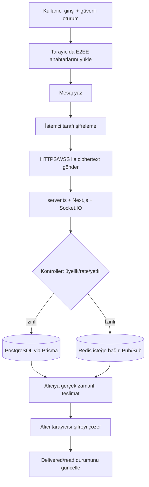

<p align="center">
  
</p>

<p align="center">
  <a href="./LICENSE"></a>
  
  
</p>

<p align="center">
  <a href="README.md">English</a> |
  <a href="README.fa.md">فارسی</a> |
  <a href="README.ru.md">Русский</a> |
  <a href="README.ar.md">العربية</a> |
  <a href="README.zh.md">中文</a> |
  <a href="README.es.md">Español</a> |
  <a href="README.th.md">ไทย</a> |
  <a href="README.pt.md">Português</a> |
  <a href="README.de.md">Deutsch</a> |
  <a href="README.da.md">Dansk</a> |
  <a href="README.sv.md">Svenska</a> |
  <a href="README.tr.md">Türkçe</a>
</p>

---

## Genel Bakış

**Elahe Messenger**, veriler üzerinde tam kontrol isteyen ekipler ve topluluklar için tasarlanmış, açık kaynaklı, kendi barındırmalı, uçtan uca şifreli (E2EE) bir mesajlaşma platformudur. **Next.js 15**, **React 19**, **Socket.IO** ve **PostgreSQL** ile **Prisma ORM** kullanılarak inşa edilmiştir.

> Sunucu hiçbir zaman mesajların düz metnini görmez. Tüm kriptografik işlemler tarayıcıda gerçekleştirilir.

---

## Özellikler

| Kategori | Yetenekler |
|---|---|
| 🔐 **Şifreleme** | Tarayıcı taraflı E2EE (ECDH-P256, HKDF-SHA256, AES-256-GCM) |
| 💬 **Mesajlaşma** | Özel mesajlar, gruplar, kanallar, reaksiyonlar, düzenleme, taslaklar |
| 👥 **Sosyal** | Kişi yönetimi, topluluklar, davet bağlantıları |
| 🛡️ **Güvenlik** | TOTP/2FA, hız sınırlaması, yerel matematik captcha, denetim günlüğü |
| 📦 **DevOps** | Docker Compose, tek satırlık yükleyici, Caddy ile otomatik SSL |
| 📱 **PWA** | Her cihaza kurulabilir |

---

## Mimari (algoritma + görsel akış şeması)

### Uçtan uca mesaj akışı algoritması

1. **Kimlik doğrulama ve oturum bağlama**: kullanıcı giriş yapar, güvenli çerez oturumu CSRF/origin kontrolleriyle korunur.
2. **İstemci anahtarlarını yükleme**: E2EE anahtarları tarayıcıda üretilir/yüklenir (Web Crypto + IndexedDB).
3. **İstemci tarafı şifreleme**: mesaj gönderilmeden önce şifrelenir; sunucu düz metne ihtiyaç duymaz.
4. **Gerçek zamanlı gönderim**: ciphertext HTTPS/WSS üzerinden `server.ts` ve Socket.IO'ya gönderilir.
5. **Sunucu güvenlik kontrolleri**: üyelik, yetkilendirme, rate limiting, kötüye kullanım önleme ve denetim logları uygulanır.
6. **Kalıcılaştırma ve dağıtım**: şifreli payload Prisma ile PostgreSQL'e yazılır; isteğe bağlı Redis Pub/Sub ölçeklemesi sağlar.
7. **Alıcı cihazlarına teslimat**: yetkili alıcı oturumlarına ciphertext gerçek zamanlı iletilir.
8. **Şifre çözme yalnızca alıcıda**: alıcının tarayıcısı yerelde çözer ve delivered/read durumunu günceller.

### Görsel akış



---

## Gereksinimler

| Bağımlılık | Minimum Sürüm |
|---|---|
| Node.js | 20 LTS |
| npm | 10+ |
| PostgreSQL | 15+ |
| Redis | 6+ (isteğe bağlı) |
| Docker + Compose | v2+ |

---

## Hızlı Başlangıç

### Tek Satırlık Yükleyici (Linux/macOS)

```bash
curl -fsSL https://raw.githubusercontent.com/ehsanking/ElaheMessenger/main/install.sh | ( [ "$(id -u)" -eq 0 ] && bash || sudo bash )
```

### Manuel Kurulum

```bash
git clone https://github.com/ehsanking/ElaheMessenger.git
cd ElaheMessenger
cp .env.example .env.local
# .env.local düzenleyin: DATABASE_URL, JWT_SECRET, ENCRYPTION_KEY, APP_URL
npm install
npx prisma migrate deploy
npm run build
npm start
```

---

## Yapılandırma

| Değişken | Varsayılan | Açıklama |
|---|---|---|
| `DATABASE_URL` | SQLite (yalnızca dev) | PostgreSQL bağlantı dizesi |
| `APP_URL` | `http://localhost:3000` | Uygulamanın genel URL'si |
| `JWT_SECRET` | Otomatik | Oturum token imzalama anahtarı |
| `ENCRYPTION_KEY` | Otomatik | AES şifreleme anahtarı |
| `ADMIN_PASSWORD` | Otomatik | **İlk girişten sonra değiştirin** |
| `REDIS_URL` | Boş | Socket.IO kümelemeyi etkinleştirir |

---

## Docker Dağıtımı

```bash
# Geliştirme
docker compose up -d

# Prodüksiyon (otomatik SSL ile)
docker compose -f compose.prod.yaml up -d --build
```

---

## Güvenlik

- **E2EE Şifreleme**: Mesajlar gönderilmeden önce tarayıcıda şifrelenir
- **Kör Sunucu**: Yalnızca şifreli metin saklar
- **2FA/TOTP**: RFC 6238, standart kimlik doğrulama uygulamalarıyla uyumlu
- **Hız Sınırlaması**: HTTP ve WebSocket katmanlarında per-IP limitleri

Güvenlik açıkları: [SECURITY.md](./SECURITY.md)

---

## Katkıda Bulunma

```bash
npm run dev        # Geliştirme sunucusu
npm run build      # Prodüksiyon derlemesi
npm run lint       # ESLint
npm test           # Testler
npm run db:setup   # Veritabanı kurulumu
```

[Conventional Commits](https://www.conventionalcommits.org/) kullanın ve `main`'e PR açın.

---

## Lisans

[MIT Lisansı](./LICENSE) altında yayınlanmıştır. Copyright © 2026 Elahe Messenger Katkıda Bulunanları.

<p align="center">❤️ ile yapıldı: <a href="https://github.com/ehsanking">@ehsanking</a> · <a href="https://t.me/kingithub">t.me/kingithub</a></p>

---

## Production Security Update (2026-03)

For critical production safety guidance, see the English README sections:
- **Production Networking Policy** (public vs private ports)
- **Database Hardening** (`POSTGRES_*` bootstrap role vs `APP_DB_*` runtime role)
- **UFW manual, opt-in setup** (never auto-enable before allowing SSH)

Keep PostgreSQL (`5432`) internal-only by default.

---

## Donate

If this project helps you, you can support its maintenance:

- **USDT (TRC20 / Tether):** `TKPswLQqd2e73UTGJ5prxVXBVo7MTsWedU`
- **TRON (TRX):** `TKPswLQqd2e73UTGJ5prxVXBVo7MTsWedU`

