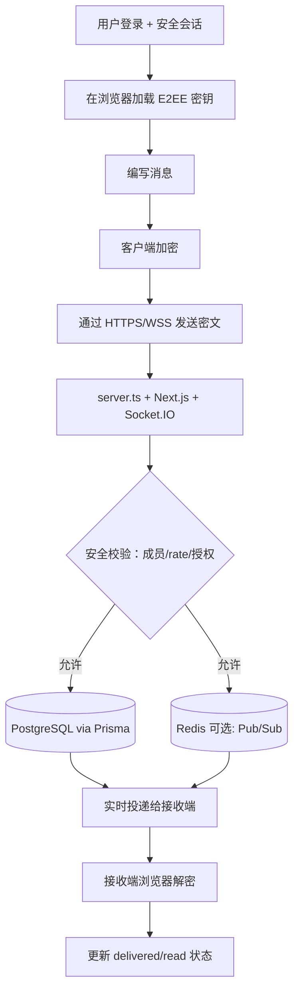

<p align="center">
  
</p>

<p align="center">
  <a href="./LICENSE"></a>
  
  
</p>

<p align="center">
  <a href="README.md">English</a> |
  <a href="README.fa.md">فارسی</a> |
  <a href="README.ru.md">Русский</a> |
  <a href="README.ar.md">العربية</a> |
  <a href="README.zh.md">中文</a> |
  <a href="README.es.md">Español</a> |
  <a href="README.th.md">ไทย</a> |
  <a href="README.pt.md">Português</a> |
  <a href="README.de.md">Deutsch</a> |
  <a href="README.da.md">Dansk</a> |
  <a href="README.sv.md">Svenska</a> |
  <a href="README.tr.md">Türkçe</a>
</p>

---

## 概述

**Elahe Messenger** 是一款开源、自托管、端到端加密（E2EE）的即时通讯平台，专为需要完全掌控数据的团队和社区设计。基于 **Next.js 15**、**React 19** 和 **Socket.IO**，使用 **Prisma ORM** 搭配 **PostgreSQL**（本地开发可使用 SQLite）。

> 服务器永远看不到消息明文。所有加密操作均在浏览器端完成。

---

## 功能特性

| 类别 | 能力 |
|---|---|
| 🔐 **加密** | 浏览器端 E2EE (ECDH-P256、HKDF-SHA256、AES-256-GCM) |
| 💬 **消息** | 私聊、群组、频道、表情反应、编辑、草稿 |
| 👥 **社交** | 联系人管理、社区群组、邀请链接、成员角色 |
| 🛡️ **安全** | TOTP/双因素认证、速率限制、本地数学验证码、审计日志 |
| 📦 **运维** | Docker Compose、一键安装脚本、Caddy 自动 SSL |
| 📱 **PWA** | 可安装到任意设备 |

---

## 架构（算法 + 可视化流程图）

### 端到端消息流算法

1. **认证并绑定会话**：用户登录后，安全 Cookie 会话持续受 CSRF/origin 校验保护。
2. **加载客户端密钥材料**：在浏览器内生成/加载 E2EE 密钥（Web Crypto + IndexedDB）。
3. **客户端加密**：消息在发送前完成加密；服务器不需要明文。
4. **实时发送**：密文通过 HTTPS/WSS 发送到 `server.ts` 与 Socket.IO。
5. **服务端安全校验**：执行成员关系、授权、限流、反滥用和审计日志检查。
6. **持久化与分发**：加密负载通过 Prisma 存入 PostgreSQL；可选 Redis 用于 Pub/Sub 扩展。
7. **投递到接收端设备**：已授权的接收端会话实时收到密文。
8. **仅在接收端浏览器解密**：接收端本地解密并更新 delivered/read 状态。

### 可视化流程图



---

## 环境要求

| 依赖 | 最低版本 |
|---|---|
| Node.js | 20 LTS |
| npm | 10+ |
| PostgreSQL | 15+ |
| Redis | 6+（可选） |
| Docker + Compose | v2+ |

---

## 快速开始

### 一键安装（Linux/macOS）

```bash
curl -fsSL https://raw.githubusercontent.com/ehsanking/ElaheMessenger/main/install.sh | ( [ "$(id -u)" -eq 0 ] && bash || sudo bash )
```

### 手动安装

```bash
git clone https://github.com/ehsanking/ElaheMessenger.git
cd ElaheMessenger
cp .env.example .env.local
# 编辑 .env.local: DATABASE_URL, JWT_SECRET, ENCRYPTION_KEY, APP_URL
npm install
npx prisma migrate deploy
npm run build
npm start
```

---

## 配置

| 变量 | 默认值 | 说明 |
|---|---|---|
| `DATABASE_URL` | SQLite（仅 dev） | PostgreSQL 连接字符串 |
| `APP_URL` | `http://localhost:3000` | 应用公共 URL |
| `JWT_SECRET` | 自动生成 | Session 令牌签名密钥 |
| `ENCRYPTION_KEY` | 自动生成 | AES 加密密钥 |
| `ADMIN_PASSWORD` | 自动生成 | **首次登录后请立即更改** |
| `REDIS_URL` | 空 | 启用 Socket.IO 集群 |

---

## Docker 部署

```bash
# 开发环境
docker compose up -d

# 生产环境（自动 SSL）
docker compose -f compose.prod.yaml up -d --build
```

---

## 安全

- **端到端加密**：消息在浏览器内加密后再传输
- **服务器盲审**：服务器仅存储密文
- **双因素认证**：RFC 6238 TOTP，兼容所有标准认证器应用
- **速率限制**：HTTP 和 WebSocket 层均有 per-IP 限制

漏洞披露：[SECURITY.md](./SECURITY.md)

---

## 参与贡献

```bash
npm run dev        # 开发服务器
npm run build      # 生产构建
npm run lint       # ESLint 检查
npm test           # 运行测试
npm run db:setup   # 数据库初始化
```

使用 [Conventional Commits](https://www.conventionalcommits.org/) 提交，向 `main` 开 Pull Request。

---

## 许可证

基于 [MIT 许可证](./LICENSE) 发布。Copyright © 2025 Elahe Messenger Contributors.

<p align="center">由 <a href="https://github.com/ehsanking">@ehsanking</a> 用 ❤️ 构建 · <a href="https://t.me/kingithub">t.me/kingithub</a></p>

---

## Production Security Update (2026-03)

For critical production safety guidance, see the English README sections:
- **Production Networking Policy** (public vs private ports)
- **Database Hardening** (`POSTGRES_*` bootstrap role vs `APP_DB_*` runtime role)
- **UFW manual, opt-in setup** (never auto-enable before allowing SSH)

Keep PostgreSQL (`5432`) internal-only by default.

---

## Donate

If this project helps you, you can support its maintenance:

- **USDT (TRC20 / Tether):** `TKPswLQqd2e73UTGJ5prxVXBVo7MTsWedU`
- **TRON (TRX):** `TKPswLQqd2e73UTGJ5prxVXBVo7MTsWedU`

